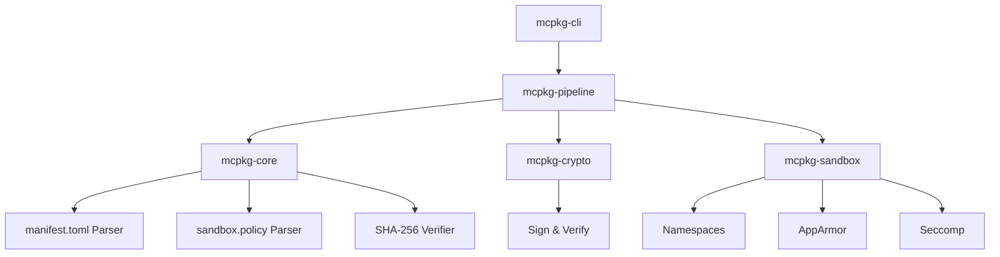

# Mimari Bakış (Architecture) — mcpkg

`mcpkg` follows a strictly modular, decoupled architecture.

## Hierarchy of Modules

## Component Roles

1.  **Orchestrator (Pipeline)**: Manages the `InstallState` state machine.
2.  **Security Engine (Sandbox)**: Translates high-level policies into kernel-level restrictions.
3.  **Trust Module (Crypto)**: Ensures packages come from verified developers.
4.  **Schema Module (Core)**: Validates package metadata against specifications.
