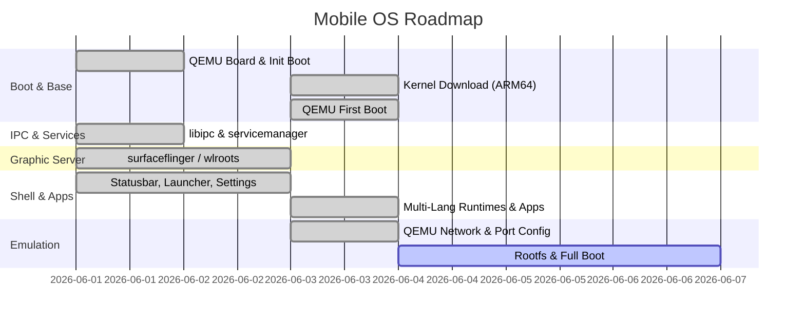

# Mobile OS - Project Progress Dashboard

This dashboard tracks the developmental progress of the Mobile OS project. It details the status of each layer from the kernel up to system applications.

---

## 📍 System Milestones

- [x] **Milestone 1: Bootable Emulator Image (QEMU-ARM64)**
  - [x] Configure minimal device configuration inside `board/qemu-arm64/`
  - [x] Implement C-based PID 1 `init` that mounts `/sys`, `/proc`, and `/dev`
  - [x] Generate basic rootfs structure with secure users (`etc/passwd` & `etc/group`)
  - [x] Implement early boot initialization shell script `/etc/init.d/rcS`
- [x] **Milestone 2: IPC & Services (The Nervous System)**
  - [x] Develop `libipc` message-passing API (serialization/deserialization via `Parcel`)
  - [x] Implement `servicemanager` registry and event loop
  - [x] Launch `powermanager` (Rust) daemon via system init configuration
  - [x] Launch `inputflinger` service
- [x] **Milestone 3: Graphics & Compositing**
  - [x] Implement `surfaceflinger` compositor C++ daemon for surface management and software layout compositing
  - [x] Create 2D graphics engine `libgraphics`
- [x] **Milestone 4: User Interface Shell & Apps**
  - [x] Develop custom Launcher C grid with touch-friendly dock
  - [x] Implement `ui/shell` statusbar and notifications panel
  - [x] Implement native Settings and Dialer apps
- [x] **Milestone 8: Rust Transition & Power Management Daemon**
  - [x] Implement `libipc-rs` wire-compatible Rust serialization and sockets
  - [x] Implement Rust-based Power Manager daemon `powermanager` supporting battery and power profiles
  - [x] Validate cross-language interoperability via integration testing
- [x] **Milestone 9: Multi-Language Application Support & Runtimes**
  - [x] Implement Rust-based Unified Application Runner `apprunner` with zero-dependency manifest parsing
  - [x] Create Python status reporter `sys_reporter` using dynamically loaded locale files
  - [x] Create JavaScript status monitor `sys_monitor` querying REST API parameters
  - [x] Create Control Center dashboard `control_center` static Web App with responsive glassmorphism styles, input key injection, and real-time status polling
  - [x] Integrate runtimes launcher in build system and package locale overlays
  - [x] Validate all 4 application runtime integrations via automated host testing
- [x] **Milestone 10: Kernel Acquisition**
  - [x] Create `scripts/download-kernel.sh` to fetch precompiled Debian ARM64 kernel
  - [x] Successfully downloaded ARM64 Linux kernel image (`out/kernel/Image`, 36 MB)
- [x] **Milestone 11: QEMU First Boot ✅**
  - [x] Fix QEMU port conflict — migrated to fixed port `9595` (HTTP: host→guest:8080)
  - [x] Update `scripts/qemu-run.sh` with initramfs approach (no block device driver needed)
  - [x] Create `scripts/make-rootfs.sh` — builds minimal ARM64 rootfs + cpio initramfs
  - [x] ARM64 kernel successfully boots in QEMU (`cortex-a72`, 4 core, 2GB RAM)
  - [x] **Mobile OS `init` engine runs as PID 1** — `/proc`, `/sys`, `/dev`, `/tmp` mounted
  - [x] `init.rc` parsed and `on boot` event block processed successfully

---

## 📊 Module Progress Matrix

| Module | Location | Status | Description |
|:---|:---|:---:|:---|
| **Board Config** | `board/qemu-arm64` | 🟢 *Complete* | Board makefile and emulator flags |
| **Kernel Defconfig**| `board/qemu-arm64/defconfig` | 🟢 *Complete* | Minimal kernel configuration fragment |
| **Init Engine** | `core/init/`       | 🟢 *Complete* | PID 1 C daemon and `.rc` parser |
| **Service Registry**| `services/servicemanager` | 🟢 *Complete* | IPC service registry and lookup database |
| **IPC Framework** | `libs/libipc/`     | 🟢 *Complete* | Parcel serialization & socket IPC |
| **IPC Framework (Rust)**| `libs/libipc-rs/` | 🟢 *Complete* | Wire-compatible Rust Parcel and binder serialization |
| **Graphics Engine** | `libs/libgraphics/` | 🟢 *Complete* | 2D drawing primitives & bitmap font rendering library |
| **Localization Engine** | `libs/libi18n/` | 🟢 *Complete* | Multi-language localization library for C applications |
| **Compositor** | `services/surfaceflinger/` | 🟢 *Complete* | Graphics layer allocation & software composition engine |
| **Power Manager (Rust)**| `services/powermanager/` | 🟢 *Complete* | Rust-based power state and battery status daemon |
| **Input Flinger (Rust)**| `services/inputflinger/` | 🟢 *Complete* | Rust-based input listener & dispatcher service |
| **API Gateway (Rust)**| `services/apigateway/` | 🟢 *Complete* | Rust HTTP REST API daemon for Android/iOS |
| **App Runner (Rust)** | `services/apprunner/` | 🟢 *Complete* | Rust-based unified application manifest executor |
| **Statusbar Daemon** | `ui/statusbar/`    | 🟢 *Complete* | C-based system statusbar & notification daemon |
| **Launcher App** | `apps/launcher/`   | 🟢 *Complete* | Home grid & desktop dock shell app |
| **Settings App** | `apps/settings/`   | 🟢 *Complete* | C-based system configuration settings application |
| **Dialer App** | `apps/dialer/`     | 🟢 *Complete* | C-based telephone keypad dialing application |
| **System Apps** | `rootfs/system/apps/` | 🟢 *Complete* | Multi-language apps (Python, JS, Web Control Center) |
| **Detailed Setup Guide** | `install.md`       | 🟢 *Complete* | Setup, runtimes, and integration testing instructions |
| **Kernel Image** | `out/kernel/Image` | 🟢 *Complete* | Precompiled ARM64 Linux kernel (36 MB, Debian netboot) |
| **QEMU Boot Script** | `scripts/qemu-run.sh` | 🟢 *Complete* | Auto port config, optional rootfs, headless & GUI modes |
| **Kernel Downloader** | `scripts/download-kernel.sh` | 🟢 *Complete* | Fetches ARM64 kernel from Debian netboot repository |
| **Rootfs Image** | `out/rootfs.ext4` | 🔴 *Pending* | ext4 disk image for full userspace boot |

---

## 🚀 Active Sprint Goals
* [x] Completed Milestone 9: Multi-Language Application Support & Runtimes.
* [x] Completed Milestone 10: ARM64 kernel downloaded (36 MB, Debian netboot).
* [x] Completed Milestone 11: **Mobile OS init engine boots as PID 1 in QEMU!** 🎉
  * Initramfs (cpio.gz) yaklaşımıyla disk driver sorunu aşıldı.
  * `/proc`, `/sys`, `/dev`, `/tmp` başarıyla mount edildi.
  * `init.rc` parse edildi, `on boot` event bloğu işlendi.
* [x] **Milestone 12:** `servicemanager` ve `powermanager` daemon'larını QEMU içinde ayağa kaldır. 🎉
* [x] **Milestone 12:** `apigateway`'i QEMU içinde başlat, host:9595 → guest:8080 tüneli test et. ✅
  - Derlenen tüm servisler ARM64 mimarisine statik olarak çapraz derlendi.
  - C `init` içerisine `init_module` sistem çağrısı eklenerek `e1000.ko` sürücüsü yüklendi.
  - Sürücüyle gelen `eth0` ve local `lo` arayüzleri `ioctl` ile ayağa kaldırılıp IP atandı (`10.0.2.15` / `127.0.0.1`).
  - Host üzerinden `curl` istekleriyle API Gateway ve Power Manager entegrasyonu doğrulandı.
