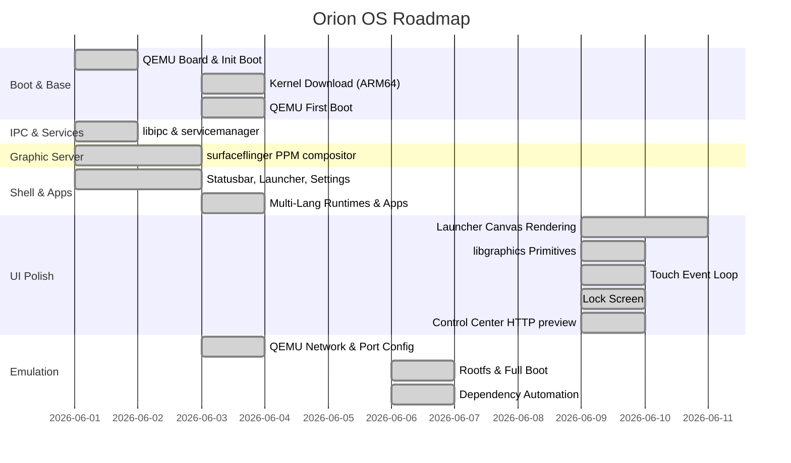

# Orion OS - Project Progress Dashboard

This dashboard tracks the developmental progress of the Orion OS project. It details the status of each layer from the kernel up to system applications.

---

## 📍 System Milestones

- [x] **Milestone 1: Bootable Emulator Image (QEMU-ARM64)**
  - [x] Configure minimal device configuration inside `board/qemu-arm64/`
  - [x] Implement C-based PID 1 `init` that mounts `/sys`, `/proc`, and `/dev`
  - [x] Generate basic rootfs structure with secure users (`etc/passwd` & `etc/group`)
  - [x] Implement early boot initialization shell script `/etc/init.d/rcS`
- [x] **Milestone 2: IPC & Services (The Nervous System)**
  - [x] Develop `libipc` message-passing API (serialization/deserialization via `Parcel`)
  - [x] Implement `servicemanager` registry and event loop
  - [x] Launch `powermanager` (Rust) daemon via system init configuration
  - [x] Launch `inputflinger` service
- [x] **Milestone 3: Graphics & Compositing**
  - [x] Implement `surfaceflinger` compositor C++ daemon for surface management and software layout compositing
  - [x] Create 2D graphics engine `libgraphics`
- [x] **Milestone 4: User Interface Shell & Apps**
  - [x] Develop custom Launcher C grid with touch-friendly dock
  - [x] Implement `ui/shell` statusbar and notifications panel
  - [x] Implement native Settings and Dialer apps
- [x] **Milestone 8: Rust Transition & Power Management Daemon**
  - [x] Implement `libipc-rs` wire-compatible Rust serialization and sockets
  - [x] Implement Rust-based Power Manager daemon `powermanager` supporting battery and power profiles
  - [x] Validate cross-language interoperability via integration testing
- [x] **Milestone 9: Multi-Language Application Support & Runtimes**
  - [x] Implement Rust-based Unified Application Runner `apprunner` with zero-dependency manifest parsing
  - [x] Create Python status reporter `sys_reporter` using dynamically loaded locale files
  - [x] Create JavaScript status monitor `sys_monitor` querying REST API parameters
  - [x] Create Control Center dashboard `control_center` static Web App with responsive glassmorphism styles, input key injection, and real-time status polling
  - [x] Integrate runtimes launcher in build system and package locale overlays
  - [x] Validate all 4 application runtime integrations via automated host testing
- [x] **Milestone 10: Kernel Acquisition**
  - [x] Create `scripts/download-kernel.sh` to fetch precompiled Debian ARM64 kernel
  - [x] Successfully downloaded ARM64 Linux kernel image (`out/kernel/Image`, 36 MB)
- [x] **Milestone 11: QEMU First Boot ✅**
  - [x] Fix QEMU port conflict — migrated to fixed port `9595` (HTTP: host→guest:8080)
  - [x] Update `scripts/qemu-run.sh` with initramfs approach (no block device driver needed)
  - [x] Create `scripts/make-rootfs.sh` — builds minimal ARM64 rootfs + cpio initramfs
  - [x] ARM64 kernel successfully boots in QEMU (`cortex-a72`, 4 core, 2GB RAM)
  - [x] **Orion OS `init` engine runs as PID 1** — `/proc`, `/sys`, `/dev`, `/tmp` mounted
  - [x] `init.rc` parsed and `on boot` event block processed successfully
- [x] **Milestone 12: Full Service Boot in QEMU**
  - [x] `servicemanager`, `powermanager`, `apigateway` running in guest
  - [x] `e1000.ko` auto-extracted by `download-kernel.sh` and loaded by init
  - [x] Network configured (`10.0.2.15`), host:9595 → guest:8080 verified
- [x] **Milestone 13: Init & Dependency Pipeline**
  - [x] `init.rc` class-based boot order (`core` → `main`) and `args` directive
  - [x] Full service list: inputflinger, surfaceflinger, statusbar, apprunner, launcher
  - [x] `apprunner` boot with `/system/apps/control_center` via init.rc
  - [x] `deps/deps.yml` + `scripts/update-deps.sh` automated dependency pipeline
  - [x] Initramfs bundles `/system/apps`, locale, and `out/` compositor directory

---

## 📊 Module Progress Matrix

| Module | Location | Status | Description |
|:---|:---|:---:|:---|
| **Board Config** | `board/qemu-arm64` | 🟢 *Complete* | Board makefile and emulator flags |
| **Kernel Defconfig**| `board/qemu-arm64/defconfig` | 🟢 *Complete* | Minimal kernel configuration fragment |
| **Init Engine** | `core/init/`       | 🟢 *Complete* | PID 1 daemon, `.rc` parser (`class`, `args`, `respawn`) |
| **Service Registry**| `services/servicemanager` | 🟢 *Complete* | IPC service registry and lookup database |
| **IPC Framework** | `libs/libipc/`     | 🟢 *Complete* | Parcel serialization & socket IPC |
| **IPC Framework (Rust)**| `libs/libipc-rs/` | 🟢 *Complete* | Wire-compatible Rust Parcel and binder serialization |
| **Graphics Engine** | `libs/libgraphics/` | 🟢 *Complete* | Rounded rect, gradient, mono bitmap draw APIs |
| **UI Icons** | `ui/icons.c` | 🟢 *Complete* | 16×16 bitmap icons scaled to 48×48 for shell apps |
| **Localization Engine** | `libs/libi18n/` | 🟢 *Complete* | Multi-language localization library for C applications |
| **Compositor** | `services/surfaceflinger/` | 🟢 *Complete* | PPM layer stack → `display_composited.ppm` (not Wayland yet) |
| **Power Manager (Rust)**| `services/powermanager/` | 🟢 *Complete* | Rust-based power state and battery status daemon |
| **Input Flinger (Rust)**| `services/inputflinger/` | 🟢 *Complete* | Rust-based input listener & dispatcher service |
| **API Gateway (Rust)**| `services/apigateway/` | 🟢 *Complete* | REST API + PPM display preview (`/api/display/*`) |
| **App Runner (Rust)** | `services/apprunner/` | 🟢 *Complete* | Rust-based unified application manifest executor |
| **Statusbar Daemon** | `ui/statusbar/`    | 🟢 *Complete* | Battery gauge, Wi-Fi/signal glyphs, HH:MM clock |
| **Launcher App** | `apps/launcher/`   | 🟢 *Complete* | Lock screen, canvas UI, input loop, tap-to-launch |
| **UI Theme** | `ui/theme.h`       | 🟢 *Complete* | Shared Orion OS color palette for native apps |
| **Settings App** | `apps/settings/`   | 🟢 *Complete* | C-based system configuration settings application |
| **Dialer App** | `apps/dialer/`     | 🟢 *Complete* | C-based telephone keypad dialing application |
| **System Apps** | `rootfs/system/apps/` | 🟢 *Complete* | Multi-language apps (Python, JS, Web Control Center) |
| **Detailed Setup Guide** | `install.md`       | 🟢 *Complete* | Setup, runtimes, and integration testing instructions |
| **Kernel Image** | `out/kernel/Image` | 🟢 *Complete* | Precompiled ARM64 Linux kernel (36 MB, Debian netboot) |
| **QEMU Boot Script** | `scripts/qemu-run.sh` | 🟢 *Complete* | Auto port config, optional rootfs, headless & GUI modes |
| **Kernel Downloader** | `scripts/download-kernel.sh` | 🟢 *Complete* | Fetches ARM64 kernel + matching `e1000.ko` module |
| **Dependency Manifest** | `deps/deps.yml` | 🟢 *Complete* | Central apt/pacman, Rust, kernel, build config |
| **Dependency Updater** | `scripts/update-deps.sh` | 🟢 *Complete* | Automated install, cargo update, kernel, rebuild |
| **Initramfs Builder** | `scripts/make-rootfs.sh` | 🟢 *Complete* | Static init, services, apps, modules → cpio.gz |
| **Rootfs Image** | `out/rootfs.ext4` | 🟢 *Complete* | ext4 virtio-blk disk boot via `qemu-run.sh --disk` |

---

## 🚀 Active Sprint Goals
* [x] Completed Milestone 11–13: Full QEMU boot with initramfs, network, and all core services.
* [x] **Milestone 14: Native UI Polish & Shell Completeness**
  - [x] **Launcher canvas rendering** — wallpaper, 4-column app grid, bottom dock → `surface_<id>.ppm`
  - [x] **Shared UI theme** — `ui/theme.h` color palette aligned with Settings/Dialer dark-violet style
  - [x] **libgraphics extensions** — `canvas_draw_rounded_rect`, `canvas_draw_gradient_rect`, bitmap draw
  - [x] **App icon bitmaps** — `ui/icons.c` 16×16 mono bitmaps scaled to 48×48
  - [x] **Statusbar enrichment** — HH:MM clock, signal/Wi-Fi glyphs, battery gauge
  - [x] **Touch event loop** — launcher registers on `mobile.input`, tap → app launch via fork/exec
  - [x] **Lock screen** — clock + swipe-up unlock before home grid (`apps/launcher/src/lockscreen.c`)
* [x] **Milestone 15: Control Center ↔ device sync (PPM over HTTP)**
  - [x] `GET /api/display/info` + `GET /api/display/frame?composite=1` in `apigateway`
  - [x] Control Center live canvas preview + tap-to-inject touch
  - [x] Integration tests: `test_display_preview.sh`, `test_api_host.sh` tests 8–9
* [x] **Milestone 16:** `out/rootfs.ext4` disk image + `--disk` QEMU boot (virtio-blk, no initramfs)
* [x] **Milestone 16.5: Full Test Suite Verification** — tüm unit ve integration testler doğrulandı
  - [x] Unit: `test_ipc`, `test_graphics_draw`, `test_i18n` ✅
  - [x] Integration: `test_api_host.sh` (9 test) ✅
  - [x] Integration: `test_apprunner_host.sh` (4 test: Python/JS/Web/TR locale) ✅
  - [x] Integration: `test_statusbar_host.sh` ✅
  - [x] Integration: `test_compositor_host.sh` ✅
  - [x] Integration: `test_native_apps_host.sh` (Settings + Dialer) ✅
  - [x] Integration: `test_launcher` (Full Bootstrap: SM + PM + SF + Launcher oneshot) ✅
  - [x] Integration: `test_display_preview.sh` (Milestone 15 API) ✅
  - [x] Integration: `test_rootfs_disk.sh` (Milestone 16 ext4) ✅
* [x] **Milestone 17:** Wayland Faz 1 (Headless wlroots compositor) ve entegrasyon testi tamamlandı ✅
  - [x] Headless wlroots0.18 compositor modülü `wl/` entegre edildi
  - [x] `test_wayland_headless.sh` ile `/tmp` socket dinlemesi ve temiz çıkış doğrulandı ✅
* [x] **Milestone 18:** Wayland Faz 2 (Paylaşımlı bellek ve ilk istemci) ve entegrasyon testi tamamlandı ✅
  - [x] `libgraphics` kütüphanesine `canvas_init_external` desteği eklendi
  - [x] `launcher` uygulaması Wayland native istemcisine dönüştürüldü ve shared memory (shm) tampon arabelleği entegre edildi
  - [x] `test_wayland_client.sh` entegrasyon testi ile istemci-sunucu arayüz eşleşmesi doğrulandı ✅
* [x] **Milestone 18-19:** Wayland Faz 3 (Tüm shell ve yerel uygulamaların Wayland geçişi) tamamlandı ✅
  - [x] `statusbar` daemon uygulaması Wayland istemcisine dönüştürüldü; display event loop ve soket asenkron seçimi entegre edildi.
  - [x] `settings` ve `dialer` uygulamaları Wayland istemcisi olarak güncellendi (tek çerçeve çizip kompozitöre commit etme mantığı).
  - [x] Tüm istemciler için Wayland başlatılamadığında sorunsuz legacy PPM fallback mantığı korundu.
  - [x] `test_wayland_apps.sh` entegrasyon testi ile tüm uygulamaların Wayland bağlantıları doğrulandı.

### UI Gap Analysis (updated 2026-06-20)

| Layer | Component | Remaining gap |
|:---|:---|:---|
| Native apps | Settings, Dialer | Static single-frame; no in-app navigation or button hit-testing |
| Graphics | `libs/libgraphics/` | No alpha blending; 8×8 font only |
| Web | Control Center | Optional: Turkish default, sys_monitor card, package manager panel |
| Wayland migration | `docs/wayland-migration.md` | 🟢 *Complete* | M17: wlroots headless, M18: launcher client, M19: full shell transition |

